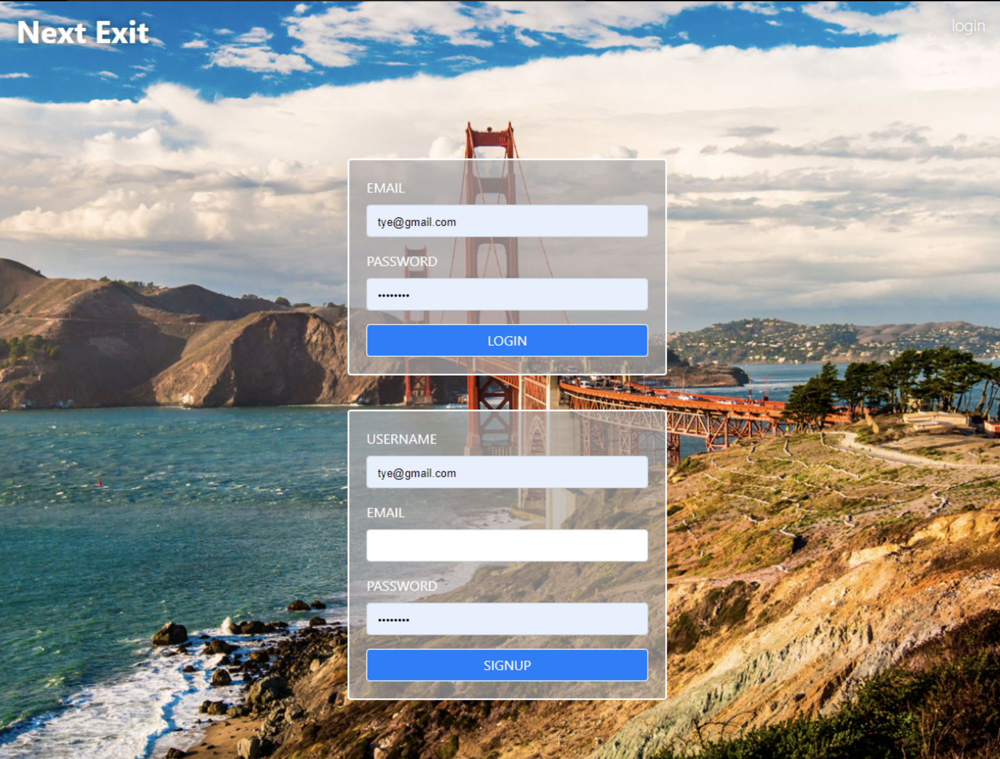
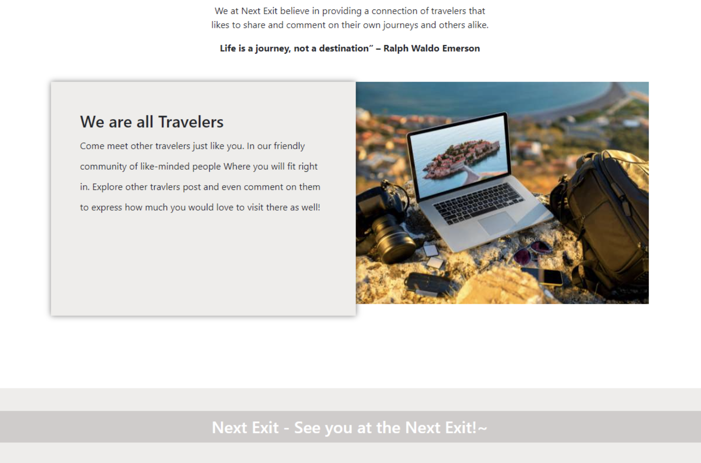

# Next Exit

## Installation
An application that will run in the browser and feature dynamically updated. Application features polished UI and is responsive, ensuring adaptation to multiple screen sizes.

To build this webpage we used: Bootstrap - Javascript - Handlebar.js - Express.js - Node.js - MySQL - Sequelize - Heroku

## About this Project
Next Exit is a social media platform for travelers to post and comment about their experiences from different places. Travelers can post about their experiences, tips and tricks, and comment on other posts as travel ramps back up in the world. 

## User Story
As a travel enthusiast, I want to be able to use a social media platform for travelers to create an account, get travel tips, and interact with other travelers to learn about and plan my next trip.

## Contributors
Tye Stanley, Chase Miller, Derik Cepeda, Gracie Navarro, and Paulina Gamboa.

## Screenshots

## Links
Deployed link: https://next-exit.herokuapp.com

Github link: https://github.com/TyeStanley/next-exit

## License

Copyright &copy; 
  Tye Stanley, Chase Miller, Derik Cepeda, Gracie Navarro, and Paulina Gamboa. 
  All rights reserved.
  
  Licensed under the [MIT](LICENSE) license.
